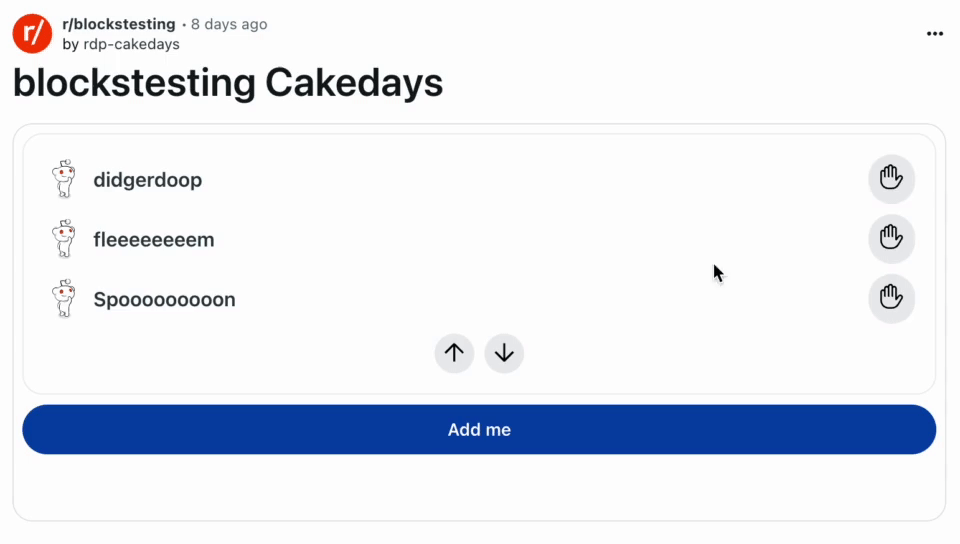

# rdp-cakedays
A custom post that lets users add themselves to and celebrate cakedays (the day their Redit user account was created).

This demonstrates how to use Custom Posts, Key Value Store and Scheduler. It implements simple pagination, responsive buttons and a basic social feature where users can high five each other on their cakedays.

# Using Cakedays
1. Install the [cakedays app](https://developers.reddit.com/apps/rdp-cakedays) on a subreddit you moderate
2. This will add three subreddit-level moderator menu actions:
    1. ***New Cakeday post***: this will create a new cakeday post in the subreddit of your choice
    2. ***Add Cakeday test data***: this will add fake data to your Cakeday KVStore for testing purposes
    2. ***Clear Cakeday KVStore***: this will delete all data from your Cakeday KVStore
3. Use "New Cakeday post" to create a new post
4. Use "Add Cakeday test data" to add test data
5. go to sh.reddit.com/r/***_yoursubredditname_***. You should see a post similar to this:

# Note
* Users must opt into sharing their Cakeday by pressing the "Add me" button
* See the [Cakedays github repo](https://github.com/reddit/devvit-sandbox/tree/main/devvit-0.10.x/rdp-cakedays-main) to fork and customize!
